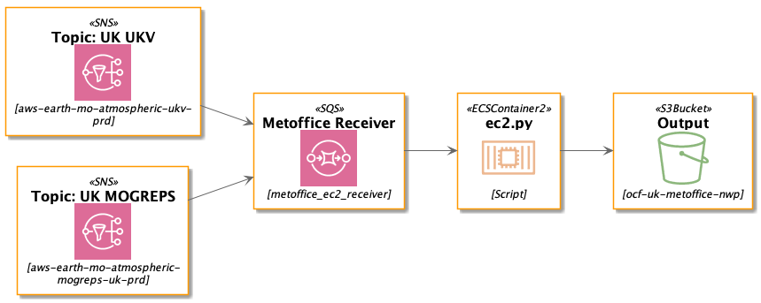

# metoffice_ec2

Extract specific parts of the [UK Met Office's UKV and MOGREPS-UK numerical weather predictions from AWS](https://registry.opendata.aws/uk-met-office/), compress, and save to S3 as Zarr.  Intended to run on AWS EC2.


## Install & test locally

```
conda env create -f environment.yml 
conda activate metoffice_ec2
pip install -e .
py.test -s
```

If `boto3` is setup to access AWS, then you can run `scripts/ec2.py` from your local machine to test (although it'll try to pull large amounts of data into & out of S3, so this will get expensive quickly!)

### Build & test Docker container locally

[Install Docker](https://docs.docker.com/engine/install/)

```
docker build .
docker run -e AWS_ACCESS_KEY_ID=<ID> -e AWS_SECRET_ACCESS_KEY=<KEY> -e DEST_BUCKET=<BUCKET> -e SQS_URL=<SQS_URL> <DockerImage>
```

## Install on AWS



A Terraform template is provided in `/infrastructure`.
A [Docker Image](https://hub.docker.com/r/openclimatefix/metoffice_ec2) is also provided publicly.

[> More Information about Infrastructure](./infrastructure/README.md)

The following environment variables must be provided:
| Name          | Type     | Description                                            |
| ------------- | -------- | ------------------------------------------------------ |
| `SQS_URL`     | `String` | The URL of the SQS that the Messages are consumed from |
| `DEST_BUCKET` | `String` | S3 bucket that the finished output should be stored in |

<details>
    <summary>Manual Setup</summary>

### Configure AWS permissions

Go to the AWS Identity and Access Management (IAM) console... *TODO*


#### Create bucket for storing NWPs

Create a bucket for storing subsetted NWPs. Set the `DEST_BUCKET` constant in `scripts/ec2.py`


### Configure AWS Simple Queue Service (SQS)

When the Met Office uploads new NWPs to S3, they also send a message to an AWS Simple Notification Service topic.  These notifications must be received as soon as they're produced.  But our EC2 job isn't kept running 24/7.  Our EC2 job is triggered once an hour.  So we need a way to capture the SNS notifications when our EC2 job is offline.

A solution is to set up an AWS Simple Queue Service.  Set up SQS as per the [Met Office's instructions](https://github.com/MetOffice/aws-earth-examples/blob/master/examples/2.%20Subscribing%20to%20data.ipynb).

Then set the `SQS_URL` in `scripts/ec2.py`

### Configure EC2 instance


#### Configure EC2 instance to trigger every hour
</details>


## Software Development

This code follows the [Google Python Style Guide](http://google.github.io/styleguide/pyguide.html).

The included `environment.yml` file includes just the packages required to run the script
and unit tests.

To do development, please run this command within the `metoffice_ec2` conda environment:

`conda install black flake8 isort jedi mypy`

Format the code with `black metoffice_ec2 scripts`.

Check coding style with `flake8`.

Fix import order with `isort -rc .`.

Run static type checking with `mypy metoffice_ec2 scripts`.

`jedi` is for auto-completion (and other things) in IDEs.
